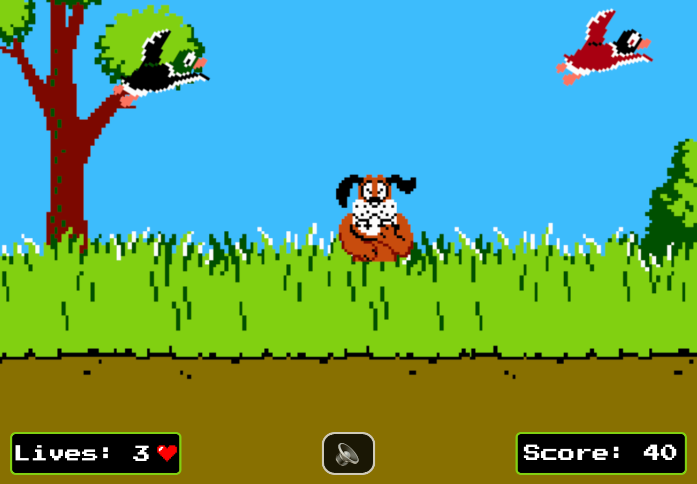

# Duck Hunt 🦆 - by Julien THOMAS

### [Play the game](duck-hunt-seven.vercel.app) 🎮

# ⚡️Introduction

I get inspired by the famous video game Duck Hunt on NES.
This game is a browser-based game using HTML, CSS, JavaScript, DOM manipulation, and Object-Oriented Programming (OOP).

# 🔥 Features

- 🏎 **Challenging difficulty levels** (increase speed of ducks)
- 🪿 **Different types of ducks**
- 🥰 **Adorable ducks**
- 🎨 **Using original design**

# ⚙️ Behind the scene

- 👾 **Game loop**
- 🎲 **Random Apparition** (frequency and duck type)
- 📱 **Responsive Design** (warning message portrait mode)
- 🎞️ **Multiple CSS Animations**

# 🌐 Credits

- Sound Effects: [Open Art Game](https://opengameart.org/) and [Sound Fishing](https://www.sound-fishing.net/)
- Sprites: [Game Makers](https://www.game-makers.xyz/)
